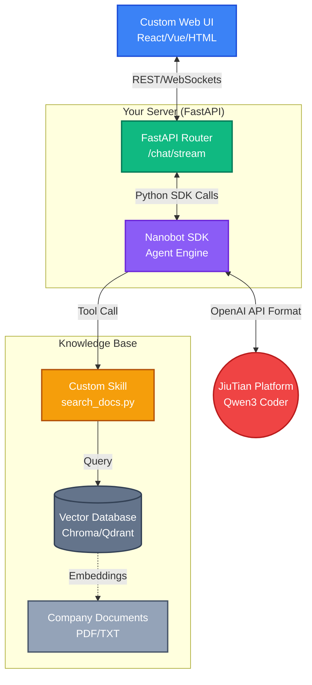

# White-Label RAG Architecture with Nanobot

This document outlines the architectural flow and implementation steps for building a custom, white-labeled Chat UI backed by a document-specific RAG system, using Nanobot as the invisible intelligent engine.

## 1. Architectural Flow

The optimal approach utilizes your existing FastAPI infrastructure, embedding Nanobot as a Python library (SDK) to handle the complex agentic reasoning and tool execution.



> [!NOTE]
> In this flow, the client only ever speaks to your FastAPI server. The client has no knowledge of Nanobot, JiuTian, or the Vector Database.

---

## 2. Step-by-Step Implementation Plan

### Phase 1: Establish the Knowledge Base (RAG)
Before the AI can search documents, they must be searchable.
1. **Choose a Vector Store:** Pick a lightweight, local vector database like **ChromaDB**, **Qdrant**, or even a simple FAISS index.
2. **Ingest Documents:** Write a small script to parse your specific documents (PDFs, internal wikis), convert them into text chunks, generate embeddings (using an embedding model), and save them to the vector store.

### Phase 2: Create the Custom Nanobot Skill
Nanobot needs to know *how* to access your knowledge base. You will teach it by writing a custom skill.
1. Create a Python file inside Nanobot's `skills/` directory (e.g., `company_knowledge.py`).
2. Write a Python function that takes a `query` string, searches your Vector DB, and returns the relevant text.
3. Decorate the function so Nanobot recognizes it as a tool:
```python
# Example pseudo-code for your custom skill
def search_company_docs(query: str) -> str:
    """Searches the internal company knowledge base for specific information."""
    results = vector_db.search(query, top_k=3)
    return format_results(results)
```

### Phase 3: Build the FastAPI Backend
Integrate Nanobot into your server using the Python SDK.
1. Inside your FastAPI app, import Nanobot.
2. Create an endpoint (e.g., `POST /chat`).
3. When a request comes in from your UI, use the Nanobot SDK to pass the message to the agent loop.
```python
# Example pseudo-code for your FastAPI router
from fastapi import FastAPI
import nanobot

app = FastAPI()

@app.post("/chat")
async def chat_endpoint(user_message: str):
    # Nanobot handles talking to JiuTian and using the custom RAG skill
    response = await nanobot.chat(message=user_message)
    return {"reply": response.text}
```
> [!TIP]
> For a better user experience, you should use **Streaming Responses** (SSE) in FastAPI so the text appears on the client UI smoothly as Qwen3 generates it.

### Phase 4: Build the Custom Client UI
1. Build your frontend using React, Vue, or plain HTML/CSS.
2. Design it to your exact branding specifications.
3. The UI simply sends the user's input to your FastAPI `POST /chat` endpoint and renders the text it receives. 

---

## Summary of Responsibilities

| Component | Responsibility |
| :--- | :--- |
| **Custom UI** | Collecting user input, displaying chat bubbles, managing user sessions in the browser. |
| **FastAPI** | Security/Auth, routing requests, acting as the middleman between UI and AI. |
| **Nanobot** | Managing chat history, orchestrating the tool-loop, and formatting the final answer. |
| **JiuTian (Qwen3)** | Generating the actual language and deciding *when* to search the RAG database. |
| **Vector DB** | Storing and retrieving the actual proprietary document chunks based on semantic similarity. |

---

## 3. Multi-Agent Teams & Specialization

When building complex workflows, you may need multiple specialized agents (e.g., a "Researcher" vs. a "Data Analyst"). Nanobot supports this through two primary patterns:

### Pattern A: The Subagent Swarm (Dynamic Orchestration)
The easiest way to form a team is to let your primary Nanobot instance act as a "Manager." 
- Configure `"maxConcurrentSubagents": 5` in your `config.json`.
- When you prompt the manager (e.g., "Research the gold market and then summarize the math"), it will use its built-in `spawn()` tool to dynamically create a background subagent, give it a specific persona, and assign it a task.
- This requires no extra code; the model delegates the work autonomously and waits for the subagent to report back.

### Pattern B: Hardcoded SDK Agents (Rigid Workflows)
If you need strict control over the agent hierarchy in your FastAPI backend, you can initialize multiple separate Nanobot Agent instances inside Python:
```python
import nanobot

# Agent 1: The Researcher (Only has Web Search tools)
researcher = nanobot.Agent(
    system_prompt="You are a data researcher...", 
    disabled_skills=["exec", "file_writer"]
)

# Agent 2: The Writer (Only has RAG skills)
writer = nanobot.Agent(
    system_prompt="You are a technical writer...",
    disabled_skills=["web_search"]
)
```
- In your FastAPI routes, you pass the output of the Researcher directly into the input of the Writer. This ensures agents never go off-script and always follow your exact predefined pipeline.

---

## 4. The Automated Hedgefund Team (Scheduled Tasks)

If your goal is to have an autonomous team of agents running on a schedule (e.g., every 15 minutes) to perform market analysis and report a consolidated decision back to you, here is how you architect it:

### The Architecture:
1. **The Scheduler:** Use a robust task scheduler (like `APScheduler` inside your FastAPI app, or a standard Linux `cron` job) to trigger the process every 15 minutes.
2. **The Manager Wake-up:** The scheduler sends a hidden API request to your FastAPI backend, which internally calls the Nanobot SDK:
   `await nanobot.chat(message="Initiate the 15-minute market sweep and report back.")`
3. **The Subagent Swarm (Delegation):** The Manager Agent immediately uses the `spawn()` tool to dispatch its team concurrently:
   - *Subagent 1 (News Analyst):* Searches the web for breaking economic news.
   - *Subagent 2 (Technical Analyst):* Uses a custom Python skill to pull live XAUUSD prices and calculate BaZi/Ganzhi technicals.
   - *Subagent 3 (Risk Manager):* Checks current portfolio equity via an API skill.
4. **Synthesis & Reporting:** The Manager waits for the subagents to finish. It reads their findings, synthesizes the data into a final "BUY/SELL/HOLD" decision, and pushes the final report to your Custom Web UI (via WebSockets) or directly to your Telegram/Discord channel.

### Implementation Checklist for the Hedgefund:
- [ ] Add `APScheduler` to your FastAPI server to run every 15 minutes.
- [ ] Increase `agents.defaults.maxConcurrentSubagents` to `3` or higher.
- [ ] Write the Python tools (Skills) for your agents to read live market data.
- [ ] Ensure your UI is set up to receive incoming WebSocket broadcasts, since the agent is initiating the conversation proactively, rather than just responding to your input!
